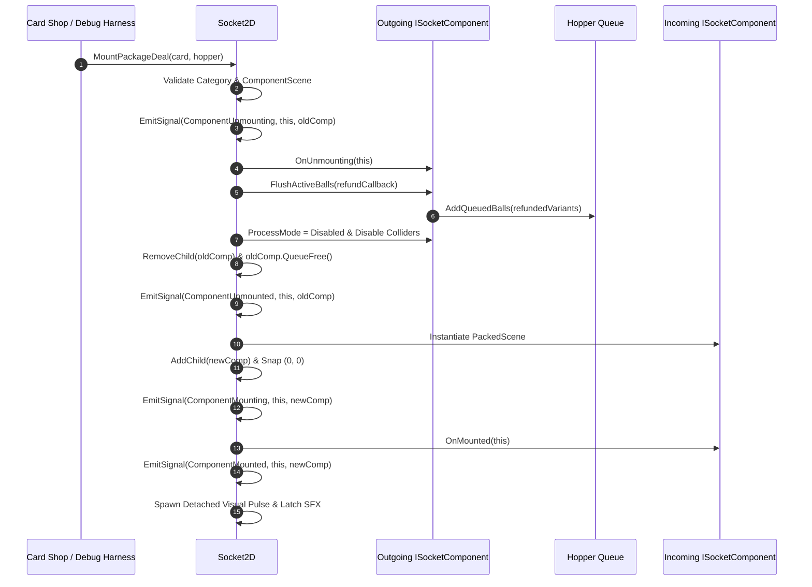

# Board Sockets & Package-Deal Cards Specification

## 1. Executive Summary & Architectural Overview

This technical specification details the architecture, node contracts, resource models, and runtime lifecycles for **Board Sockets** and **Package-Deal Cards** in Pachi, implementing the core design tenets established in [ADR 0003](file:///home/axel/workspace/axelmagn/pachi/pachi/docs/adr/0003-designated-board-sockets.md) and [ADR 0005](file:///home/axel/workspace/axelmagn/pachi/pachi/docs/adr/0005-package-deal-cards-and-deal-meter-shop.md).

### Core Architectural Decisions
1. **Designated Sockets over Freeform Placement**: Board modification is constrained to fixed, engineered 2D sockets on the vertical playfield rather than freeform grid placement, protecting ball deflection dynamics while providing modular upgrade paths ([ADR 0003](file:///home/axel/workspace/axelmagn/pachi/pachi/docs/adr/0003-designated-board-sockets.md)).
2. **Package-Deal Scene Overwriting**: Sockets hold self-contained `PackedScene` instances containing integrated deflection pins and kinetic/scoring mechanisms. Swapping a component cleanly flushes, disables physics, and replaces the entire subtree without mutating granular sub-properties ([ADR 0005](file:///home/axel/workspace/axelmagn/pachi/pachi/docs/adr/0005-package-deal-cards-and-deal-meter-shop.md)).
3. **Discrete Exact-Tier Ball Cost**: Cards specify an exact quantity ($1\text{--}4$) of an exact ball tier ($1\text{--}4$) drawn from the FIFO Hopper Queue ([ADR 0005](file:///home/axel/workspace/axelmagn/pachi/pachi/docs/adr/0005-package-deal-cards-and-deal-meter-shop.md)).
4. **WYSIWYG Starter Hierarchy**: Sockets in `Level.tscn` are pre-populated with starter component child instances, ensuring full visual preview in the Godot 2D editor and automatic runtime component adoption in `Socket2D._Ready()`.

---

## 2. Domain Glossary & Architecture References

All terms adhere strictly to [CONTEXT.md](file:///home/axel/workspace/axelmagn/pachi/pachi/CONTEXT.md):

- **Socket**: A designated, fixed mounting position on the board that accepts specific modular component cards. *(Avoid: Slot, Tile, Grid Cell)*
- **Package-Deal Card**: A self-contained component card that completely replaces the existing node instance inside a designated socket with a fresh `PackedScene` component. *(Avoid: Upgrade Card, Modifier Card, Mutation Card)*
- **Beetle Pocket**: Scoring pocket on the board with animated tulip wings and distinct payout behaviors. *(Avoid: Goal, Scoring Hole, Cup)*
- **Spinner**: Kinetic obstacle applying lateral and rotational impulses to descending balls.
- **Yakumono**: Specialized centerpiece feature activating Fever reward states and dynamic ball payouts. *(Avoid: Center Pocket, Gimmick)*
- **Ball Refund**: Recovery process that returns balls held or caught during component hot-swapping 1:1 back into the Hopper Queue. *(Avoid: Ball Recycle, Void Ball)*
- **Hopper Queue**: Strict FIFO sequential collection of `BallVariant` instances awaiting launch.

---

## 3. Node Architecture: `Socket2D`

### 3.1 Class Definition
- **File**: `res://src/sockets/Socket2D.cs`
- **Inheritance**: `Node2D`
- **Attributes**: `[Tool]`, `[GlobalClass]`

### 3.2 Category Enumeration
Sockets and cards share a consolidated 3-category spatial classification:
```csharp
public enum SocketCategory
{
    BeetlePocket,
    Spinner,
    Yakumono
}
```
*(Note: Pin patterns are bundled directly inside component scenes. Non-spatial passive relics are managed off-board by a separate manager).*

### 3.3 Node Properties
- `[Export] public SocketCategory Category { get; set; }`: Required category match for mounted cards.
- `[Export] public string SocketId { get; set; } = string.Empty;`: Unique semantic board identifier (`"yakumono_center"`, `"spinner_left"`, `"spinner_right"`, `"pocket_left"`, `"pocket_center"`, `"pocket_right"`).
- `[Export] public Vector2 BoundsSize { get; set; } = new Vector2(100, 140);`: Visual bounding box dimension for in-editor gizmo rendering.
- `public Node2D? CurrentComponent { get; private set; }`: Read-only reference to the active mounted child node.

### 3.4 Lifecycle Signals
```csharp
[Signal] public delegate void ComponentMountingEventHandler(Socket2D socket, Node2D incomingComponent);
[Signal] public delegate void ComponentMountedEventHandler(Socket2D socket, Node2D mountedComponent);
[Signal] public delegate void ComponentUnmountingEventHandler(Socket2D socket, Node2D outgoingComponent);
[Signal] public delegate void ComponentUnmountedEventHandler(Socket2D socket, Node2D unmountedComponent);
```

### 3.5 In-Editor `[Tool]` Visuals
When `Engine.IsEditorHint()`:
- `_Draw()` renders a dashed rectangular bounding box sized to `BoundsSize` centered at `(0, 0)`.
- **Color Coding**:
  - `BeetlePocket`: Amber (`Color(1.0f, 0.75f, 0.2f, 0.8f)`)
  - `Spinner`: Purple (`Color(0.7f, 0.3f, 1.0f, 0.8f)`)
  - `Yakumono`: Magenta / Gold (`Color(1.0f, 0.2f, 0.6f, 0.8f)`)
- Renders centered text displaying `Category` and `SocketId`.
- Dimmed preview alpha if a child component is already present.

---

## 4. Resource Model: `PackageDealCard` & `ISocketComponent`

### 4.1 `PackageDealCard` Resource
- **File**: `res://src/cards/PackageDealCard.cs`
- **Inheritance**: `Resource`
- **Attributes**: `[GlobalClass]`

```csharp
[GlobalClass]
public partial class PackageDealCard : Resource
{
    [Export] public string CardId { get; set; } = string.Empty;
    [Export] public string Title { get; set; } = string.Empty;
    [Export(PropertyHint.MultilineText)] public string Description { get; set; } = string.Empty;
    [Export] public SocketCategory Category { get; set; }
    [Export] public PackedScene ComponentScene { get; set; } = null!;

    // Discrete Ball Cost (ADR 0005)
    [Export(PropertyHint.Range, "1,4,1")] public int BallCostCount { get; set; } = 1;
    [Export(PropertyHint.Range, "1,4,1")] public int BallCostTier { get; set; } = 1;

    // Visual & Draft Metadata
    [Export] public Texture2D? IconTexture { get; set; }
    [Export] public Color AccentColor { get; set; } = Colors.White;
    [Export] public int BaseWeight { get; set; } = 100;
}
```

### 4.2 `ISocketComponent` Interface
- **File**: `res://src/sockets/ISocketComponent.cs`
- Implemented by root nodes of all socketable scenes (`Pocket`, `Spinner`, `Yakumono`):

```csharp
public interface ISocketComponent
{
    SocketCategory Category { get; }
    Vector2 ComponentBounds { get; }
    void OnMounted(Socket2D parentSocket);
    void OnUnmounting(Socket2D parentSocket);
    void FlushActiveBalls(Action<BallVariant> refundCallback);
}
```

---

## 5. Hot-Swap & Teardown Lifecycle

Component hot-swapping is an atomic, synchronous operation performed in `Socket2D.MountPackageDeal(PackageDealCard card, Hopper hopper)`:



### Execution Steps:
1. **Pre-Mount Validation**: Verifies `card.Category == this.Category` and `card.ComponentScene != null`.
2. **Unmount Notification**: Emits `ComponentUnmounting(this, outgoingComponent)` and calls `outgoingComponent.OnUnmounting(this)`.
3. **Ball Flush & 1:1 Refund**: Calls `outgoingComponent.FlushActiveBalls(refundCallback)`. Occupied input slots or trapped balls are recovered as `BallVariant` items and appended to the tail of the Hopper Queue without loss.
4. **Collision Suppression**: Sets `outgoingComponent.ProcessMode = ProcessMode.Disabled` and immediately disarms all descendant collision shapes/areas.
5. **Teardown**: Calls `RemoveChild(outgoingComponent)` and `outgoingComponent.QueueFree()`, followed by `ComponentUnmounted` emission.
6. **Instantiation & Attachment**: Instantiates `card.ComponentScene`, adds it as a child of `Socket2D`, and resets its local `Position` and `Rotation` to `Vector2.Zero` and `0.0f`.
7. **Mount Initialization**: Emits `ComponentMounting`, calls `incomingComponent.OnMounted(this)`, updates `CurrentComponent`, and emits `ComponentMounted`.
8. **Detached Feedback**: Spawns golden flash/particle visual burst at `Socket2D.GlobalPosition` under the board effects root and plays mechanical latch audio.

---

## 6. Starter Board Layout & Hierarchy (`Level.tscn`)

The 388 × 508 playfield is organized into a balanced 2-row × 3-column modular grid (6 total sockets):

```
+-------------------------------------------------------------+
|                     [ PRIZE METER ]                         |
|   (Launch Hole) --->                                        |
|                                                             |
|   [ Spinner Left ]       [ YAKUMONO ]       [ Spinner Right]|
|   (Pins + Spinner)     (Pins + Centerpiece) (Pins + Spinner)|
|   (-110, -40)              (0, -40)           (110, -40)    |
|                                                             |
|   [ Pocket Left ]       [ Pocket Center ]   [ Pocket Right ]|
|   (Pins + Tulip)         (Pins + Tulip)      (Pins + Tulip) |
|   (-115, 130)              (0, 130)           (115, 130)    |
|                                                             |
|                     \   [ DRAIN ]   /                       |
+-------------------------------------------------------------+
```

### 6.1 Socket Grid Coordinates & Starter Configurations

| Socket ID | Node Path in `Level.tscn` | Category | Position $(X, Y)$ | Bounds Size $(W, H)$ | Starter Component Scene |
| :--- | :--- | :--- | :--- | :--- | :--- |
| `yakumono_center` | `Sockets/Yakumono/SocketYakumonoCenter` | `Yakumono` | `(0, -40)` | `(110, 160)` | `res://src/yakumono/starter_yakumono.tscn` |
| `spinner_left` | `Sockets/Spinners/SocketSpinnerLeft` | `Spinner` | `(-110, -40)` | `(100, 160)` | `res://src/spinner/starter_spinner_left.tscn` |
| `spinner_right` | `Sockets/Spinners/SocketSpinnerRight` | `Spinner` | `(110, -40)` | `(100, 160)` | `res://src/spinner/starter_spinner_right.tscn` |
| `pocket_left` | `Sockets/Pockets/SocketPocketLeft` | `BeetlePocket` | `(-115, 130)` | `(105, 150)` | `res://src/pockets/starter_pocket_left.tscn` |
| `pocket_center` | `Sockets/Pockets/SocketPocketCenter` | `BeetlePocket` | `(0, 130)` | `(105, 150)` | `res://src/pockets/starter_pocket_center.tscn` |
| `pocket_right` | `Sockets/Pockets/SocketPocketRight` | `BeetlePocket` | `(115, 130)` | `(105, 150)` | `res://src/pockets/starter_pocket_right.tscn` |

### 6.2 `Level.tscn` Scene Tree Structure
```
Level (Node2D)
├── Camera2D
├── Boundary (Node2D)
├── LaunchHole (LaunchHole)
├── Drain (Drain)
├── BallsRoot (Node2D)
└── Sockets (Node2D)
    ├── Yakumono (Node2D)
    │   └── SocketYakumonoCenter (Socket2D)
    │       └── StarterYakumono (Yakumono: ISocketComponent)
    ├── Spinners (Node2D)
    │   ├── SocketSpinnerLeft (Socket2D)
    │   │   └── StarterSpinnerLeft (Spinner: ISocketComponent)
    │   └── SocketSpinnerRight (Socket2D)
    │       └── StarterSpinnerRight (Spinner: ISocketComponent)
    └── Pockets (Node2D)
        ├── SocketPocketLeft (Socket2D)
        │   └── StarterPocketLeft (Pocket: ISocketComponent)
        ├── SocketPocketCenter (Socket2D)
        │   └── StarterPocketCenter (Pocket: ISocketComponent)
        └── SocketPocketRight (Socket2D)
            └── StarterPocketRight (Pocket: ISocketComponent)
```

---

## 7. Legacy Card System Migration & Deprecation Matrix

All freeform drag-and-drop card systems and sub-property modifier archetypes are completely removed.

### 7.1 Deletion Matrix
- **Controllers & UI**:
  - `src/cards/CardDragController.cs` & `.cs.uid`
  - `src/cards/CardSidebar.cs` & `.cs.uid`, `src/cards/card_sidebar.tscn`
  - `src/cards/CardUI.cs` & `.cs.uid`, `src/cards/card_ui.tscn`
  - `src/cards/CardGenerator.cs` & `.cs.uid`
- **Data Models & Archetypes**:
  - `src/cards/CardData.cs` & `.cs.uid`
  - `src/cards/archetypes/*` (All 10 archetype files and `.uid` sidecars)
- **Legacy Tests**:
  - `src/cards/tests/CardGuardrailTests.cs` & `.cs.uid`

### 7.2 Node Cleanups
- **`Pocket.cs`**: Remove `CardDragController` registration and target highlight hooks.
- **`Hopper.cs`**: Remove `CardDragController` assertions.
- **`main_game.tscn`**: Remove `CardSidebar` and `CardDragController` nodes.
- **`BallAwardIndicator.cs`**: Retained in `src/cards/` to render bonus pip clusters on Deal cards.

---

## 8. Automated Test Suite & Interim Debug Harness

### 8.1 Automated Test Fixtures (`src/tests/TestRunner.cs`)
1. **`SocketLifecycleTests.cs`**:
   - `TestSocketInitialization()`: Category verification and auto-adoption of embedded starter scene.
   - `TestMountingCategoryValidation()`: Enforces category matching; rejects mismatched cards.
   - `TestSafeFlushAndRefund()`: Validates 1:1 ball refunds into the Hopper Queue and cleanup of outgoing component.
   - `TestLifecycleSignalSequence()`: Confirms exact signal emission ordering.
   - `TestProcessModeSuppression()`: Verifies physics collision disarming during teardown.
2. **`PackageDealCardTests.cs`**:
   - `TestPackageDealCardProperties()`: Verifies resource properties, discrete ball costs (1–4, 1–4), and weight.
   - `TestBonusBallAwarding()`: Confirms bonus ball award dispatches.
3. **`PocketIndicatorTests.cs`**:
   - Retained and updated to verify pip rendering on modular pocket instances.

### 8.2 Interim Debug Socket Harness (`SocketDebugHarness`)
- **Location**: `src/sockets/debug/SocketDebugHarness.cs` & `socket_debug_harness.tscn`
- **Visibility**: Active only in development builds (`#if DEBUG` / `OS.IsDebugBuild()`).
- **Features**:
  - Floating UI overlay listing mock `PackageDealCard` instances.
  - Dropdown selector for the 6 board sockets.
  - Interactive "Hot-Swap" button to trigger synchronous in-game component swaps.
  - "Flush Sockets" button to manually test ball evacuation and refunds during active ball play.

---

## 9. Verification & Acceptance Criteria

1. **Clean Compilation**: Zero errors and zero warnings under `dotnet build Pachi.sln` (`TreatWarningsAsErrors=true`).
2. **Headless Test Suite**: `godot-mono --headless -s src/tests/TestRunner.cs` passes with 100% test success across all test fixtures.
3. **Code Formatting**: `dotnet format Pachi.sln --verify-no-changes` passes cleanly.
4. **Editor Visuals**: Sockets render distinct colored bounds and labels in the Godot 2D editor; starter components are visible in `Level.tscn`.
5. **Interactive Hot-Swapping**: `SocketDebugHarness` successfully replaces components mid-play, issuing exact 1:1 ball refunds to the Hopper Queue and preventing physics glitches.
