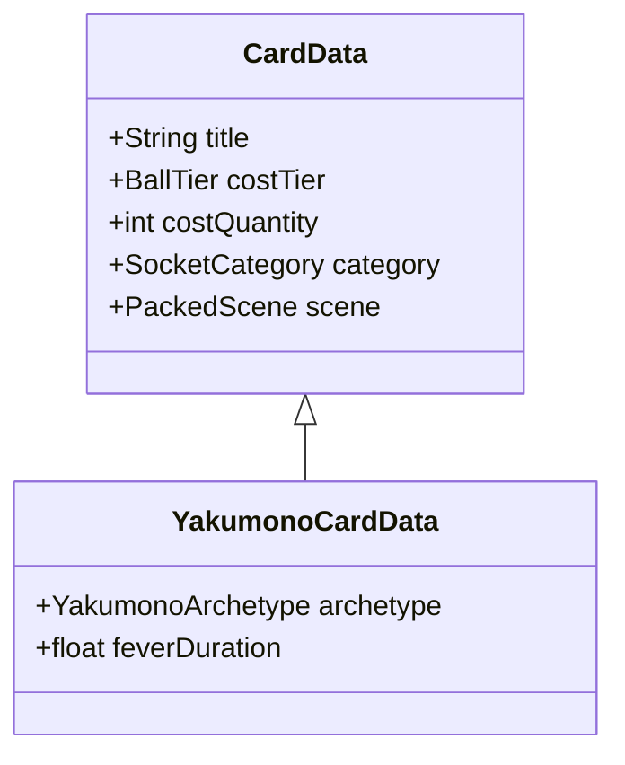
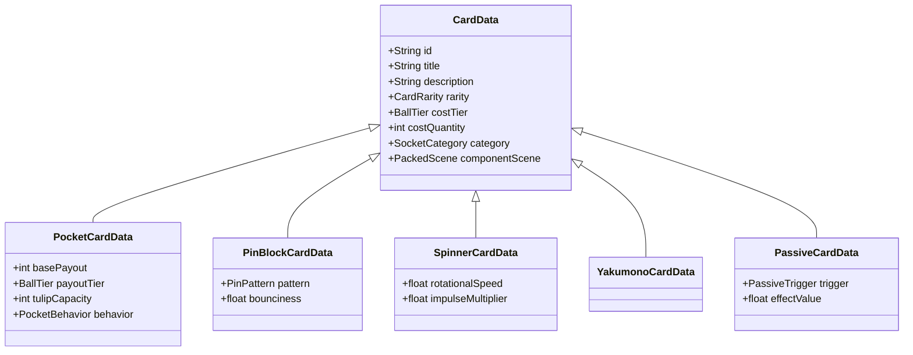

# Pachi Card System Specification

## 1. Executive Summary & Design Principles

The Card System governs in-run board building and deck progression in Pachi. It translates player deck choices into tangible, physical modifications on the single vertical pachinko playfield.

### Core Principles
1. **Package-Deal Replacement**: Cards overwrite designated board sockets with self-contained components (`PackedScene`) rather than mutating low-level properties ([ADR 0005](file:///home/axel/workspace/axelmagn/pachi/pachi/docs/adr/0005-package-deal-cards-and-deal-meter-shop.md)).
2. **Kinetic Shop Dealing**: The Card Shop operates via a passive, score-accelerated **Deal Meter** and a sequential **Deal Cursor** across a 3x3 grid, eliminating manual reroll button spam.
3. **Exact Discrete Ball Economy**: Cards cost a discrete quantity ($1\text{--}4$) of a specific Ball Variant tier ($1\text{--}4$) from a strict FIFO **Hopper Queue**.
4. **Distinct Centerpiece Archetypes**: Yakumono cards mount into a dedicated center socket, activating high-intensity **Fever** events and dynamic mechanical identities.

---

## 2. Package-Deal Socket Model & Replacement Lifecycle

All board-building components mount strictly into fixed, pre-engineered **Sockets** on the board ([ADR 0003](file:///home/axel/workspace/axelmagn/pachi/pachi/docs/adr/0003-designated-board-sockets.md)).

```
+------------------------------------------+
|            [ PRIZE METER ]               |
|  (Launcher Channel) --->                 |
|                                          |
|         [ Pin Block Socket 1 ]           |
|                                          |
|  [ Spinner 1 ]   [ YAKUMONO ]  [ Spinner 2 ]
|                                          |
|    [ Pocket A ]              [ Pocket B ]|
|         [ Pin Block Socket 2 ]           |
|                                          |
|    [ Pocket C ]  [ Pocket D ]  [ Pocket E ]
|               \              /           |
|                [ BOT DRAIN ]             |
+------------------------------------------+
```

### 2.1 Socket Categories & Matching
Cards enforce strict 1:1 category compatibility with board sockets:

| Socket Category | Board Count | Accepted Card Data Type | Role |
| :--- | :--- | :--- | :--- |
| **Beetle Pocket** | 5 | `PocketCardData` | Primary scoring targets with animated tulip wings. |
| **Pin Block** | 2 | `PinBlockCardData` | Modular clusters of deflection pins shaping ball flow. |
| **Spinner** | 2 | `SpinnerCardData` | Kinetic obstacles applying lateral/rotational impulses. |
| **Yakumono** | 1 | `YakumonoCardData` | Dedicated centerpiece jackpot feature. |
| **Passive (Global)** | 3 | `PassiveCardData` | Run-wide modifiers occupying off-board passive slots. |

### 2.2 Component Replacement Lifecycle
1. **Initial Population**: Every socket is populated with baseline starter components at run initialization.
2. **Purchase & Socket Selection**: When the player selects a card and clicks an eligible socket:
   - **Ball Flush & Refund**: Any balls currently contained or processing inside the outgoing component are immediately refunded or scored to the Hopper Queue.
   - **Signal & Tween Teardown**: Active tweens, particle systems, physics processes, and signal bindings on the old component are terminated.
   - **Node Disposal**: The outgoing component instance is removed from the scene tree and freed (`QueueFree()`).
   - **Instantiation & Mounting**: The card's `PackedScene` is instantiated, attached as a child of the designated Socket node, and initialized.
   - **Installation FX**: A kinetic flash, particle burst, and mounting sound effect play at the socket location.

---

## 3. Card Shop Display & Deal Cursor Mechanics

The in-run Card Shop presents cards drawn from the player's finite Master Deck in a structured 3-row layout.

```
+-------------------------------------------------------+
|                       CARD SHOP                       |
|   Deal Meter: [===========>        ] 65% (+0.5x)      |
|                                                       |
| > ROW 0 [CURSOR]                                      |
|   +----------------+ +----------------+ +-----------+ |
|   | Basic Pocket   | | Funnel Pins    | | Brass (T2)| |
|   | Cost: 2x T1    | | Cost: 3x T1    | | Cost: 1xT1| |
|   +----------------+ +----------------+ +-----------+ |
|                                                       |
|   ROW 1                                               |
|   +----------------+ +----------------+ +-----------+ |
|   | Splitting Tulip| | Kinetic Spinner| | Gold (T3) | |
|   | Cost: 1x T2    | | Cost: 2x T1    | | Cost: 2xT2| |
|   +----------------+ +----------------+ +-----------+ |
|                                                       |
|   ROW 2                                               |
|   +----------------+ +----------------+ +-----------+ |
|   | [ EMPTY ]      | | [ EMPTY ]      | | [ EMPTY ] | |
|   +----------------+ +----------------+ +-----------+ |
+-------------------------------------------------------+
```

### 3.1 3x3 Grid & Deal Cursor Cycle
- **Grid Layout**: 3 rows of 3 card slots (up to 9 cards displayed simultaneously).
- **Initial Deal**: At run start, Row 0 is dealt 3 cards; the Deal Meter starts at 0% with the Deal Cursor targeting Row 1.
- **Deal Cursor Cycle**: The Deal Cursor advances strictly top-down:
  $$\text{Next Row} = (\text{Current Row} + 1) \bmod 3$$

### 3.2 Row Discard & Deal Overwrite Rules
- **Row Discard on Purchase**: Purchasing any 1 card from Row $R$ immediately moves the remaining 2 unpurchased cards in Row $R$ to the **Discard Pile**. Row $R$ remains empty until the Deal Cursor targets it again.
- **Deal Overwrite on Meter Fill**: When the Deal Meter reaches 100%, any cards currently sitting in the targeted row are sent to the Discard Pile, and up to 3 fresh cards from the Master Deck are dealt into that row.
- **Atomic Purchase Lock**: If the Deal Meter fills while the player is interacting with a card / selecting a socket, the deal execution yields until the purchase resolves or cancels.

### 3.3 Master Deck Exhaustion
- The Master Deck contains a finite set of cards configured for the run.
- **Partial Deals**: If fewer than 3 cards remain in the deck when dealing, only the remaining cards are dealt.
- **Deck Depleted**: When the Master Deck hits 0 cards, the Deal Meter stops permanently, displaying "Deck Exhausted". Remaining dealt cards remain purchasable until the run concludes with a Prestige Reset.

---

## 4. Deal Meter Pacing & Scoring Acceleration

The Deal Meter fills passively over time and accelerates dramatically from gameplay scoring events.

### 4.1 Pacing Parameters

| Parameter | Value | Behavior |
| :--- | :--- | :--- |
| **Baseline Fill Time** | $20.0\text{ s}$ | $5.0\%/\text{second}$ passive fill rate under neutral play. |
| **Pocket Scoring Boost** | $+10\%$ flat $+0.5\times$ speed ($5.0\text{ s}$) | Instant chunk + temporary fill speed boost ($1.5\times$ total). |
| **Yakumono Scoring Boost** | $+35\%$ flat $+2.0\times$ speed ($5.0\text{ s}$) | Massive instant chunk + temporary speed boost ($3.0\times$ total). |
| **Meter Hard Clamp** | $100\%$ cap | Overflow percentage does not carry over; meter resets cleanly to $0\%$. |

$$\text{Active Fill Rate}(t) = 5.0\%/\text{s} \times \left(1.0 + \sum \text{Active Speed Multipliers}\right)$$

---

## 5. Discrete Ball Tier Economy & FIFO Hopper Model

### 5.1 Strict FIFO Hopper Queue
- All balls in reserve live in a single sequential First-In-First-Out **Hopper Queue** (`Queue<BallVariant>`):
  - **Launching**: Always draws the ball at the head (front) of the queue.
  - **Payouts & Refunds**: All pocket payouts, Yakumono rewards, and refunded stuck balls append to the tail of the queue.
- **Capacity**: Unlimited queue capacity (soft cap 999).
- **HUD Preview**: Displays a physical rail showing the next 5–8 balls at the launcher head, alongside total inventory badges per tier (`[T1: x14] [T2: x3] [T3: x1] [T4: x0]`).

### 5.2 Card Purchasing Validation & Deduction
- **Exact-Tier Cost**: A card costs $N$ balls of Tier $T$ ($N \in [1, 4]$, $T \in [1, 4]$).
- **Validation Rule**:
  $$\text{CanPurchase} \iff \text{Hopper.CountTier}(T) \ge N$$
- **Hopper-Only Scope**: Airborne balls in flight cannot be spent.
- **No Downward Substitution**: Tier 3 balls cannot substitute for Tier 1 or Tier 2 ball costs.
- **Deduction Execution**: Removes the earliest $N$ instances of Tier $T$ balls from front-to-back in the queue, preserving the relative order of all other queued balls.

### 5.3 Emergency Drip (Zero-Ball Recovery)
- If `Hopper.Count == 0 && ActiveBallsInFlight == 0`:
  - After a 2.0-second delay, an **Emergency Drip** dispenses 3 Tier-1 balls into the hopper tail to prevent softlocks.

---

## 6. Yakumono Centerpiece Archetypes & Fever System

The central Yakumono is the premier mechanical attraction on the board.

### 6.1 Entry & Fever Lifecycle
- **Physical Catch**: Entering ball enters the mouth/funnel, triggering a 0.5s chewing/celebration animation before clean despawn.
- **Fever Duration**: Activates a 10.0-second **Fever Mode**.
- **Re-Entry Stacking**: Subsequent ball entries during Fever reset the timer to 10.0s and award cumulative payouts.
- **Tulip Lock**: All Beetle Pocket tulip wings on the board lock wide open for the full 10-second Fever, catching balls without closing.
- **Deal Surge**: Awards $+35\%$ instant Deal Meter fill and $+2.0\times$ fill speed multiplier for 5.0 seconds.

### 6.2 Yakumono Package-Deal Archetypes



| Archetype | Name Example | Mechanical Behavior |
| :--- | :--- | :--- |
| **Multi-Ball Erupter** | *Gatling Beetle* | Erupts bursts of physical bonus balls directly onto the board (**Board Eruption**) during Fever. |
| **High-Tier Alchemist** | *Midas Core* | Payouts concentrate into scarce Tier 3 (Gold) and Tier 4 (Ruby) balls deposited into the hopper queue. |
| **Shop Dynamo** | *Market Surge* | Instantly deals a bonus shop row and temporarily discounts card ball costs by 1. |
| **Tulip Overdrive** | *Queen Chrysalis* | Extends Fever duration to 15s and grants $+2\times$ payout multipliers to all Beetle Pockets. |

---

## 7. Card Taxonomy & Data Model



---

## 8. Visual, Audio & Kinetic Feedback

1. **Card Dealing**: Fast kinetic slide-in from right sidebar to row slots with an audible card flutter/snap sound.
2. **Card Discarding**: Vaporize / slide-out fade to Discard Pile with subtle woosh.
3. **Socket Installation**: Golden flash, expanding ring particle burst, and mechanical latching "clack" audio.
4. **Deal Cursor**: Soft pulsing neon border highlighting the active row target.
5. **Fever Activation**: Screen shake, celebratory chime, golden background pulse, and particle confetti.
