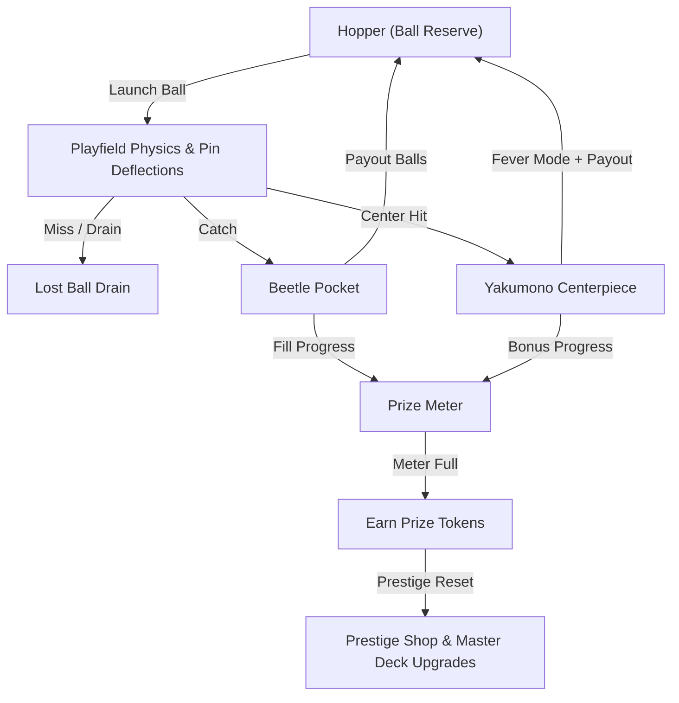
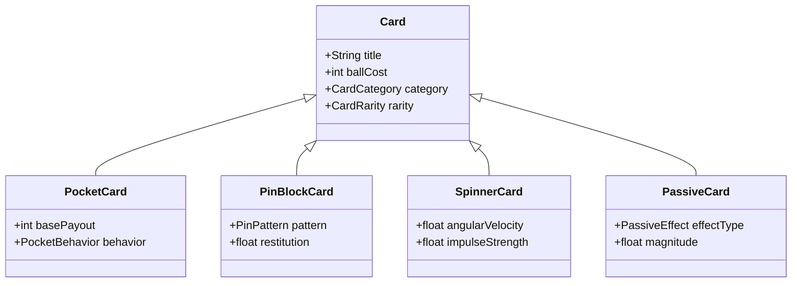
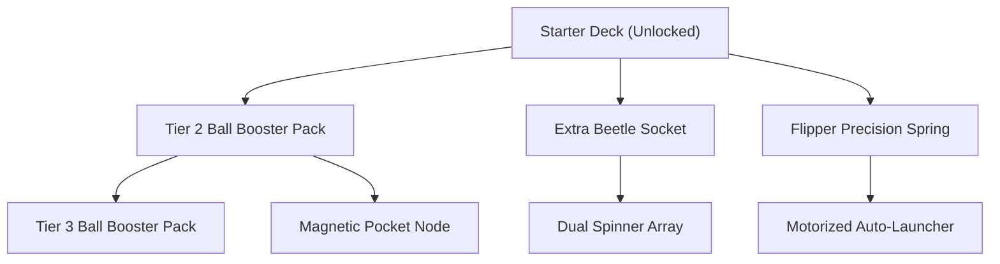

# Pachi MVP Design Specification

## 1. Executive Summary & Vision Alignment

Pachi is a physics-based pachinko incremental deckbuilder built in Godot 4.7 with C#. The game captures the kinetic excitement and auditory spectacle of Japanese pachinko parlors within a minimalist, relaxing incremental loop.

The MVP specification defines the minimal complete playable ruleset across four core design pillars established in [`docs/vision.md`](file:///home/axel/workspace/axelmagn/pachi/pachi/docs/vision.md):
1. **It is Pachinko**: Physical balls serve as the simultaneous play resource and currency. Deflections off pins, pocket entries, and center jackpot triggers drive the sensory experience.
2. **It is Incremental**: Layered progression curves scale ball values, pocket payouts, and board capabilities.
3. **It is a Deckbuilder**: Upgrades appear as cards in an in-run shop drawn from a customizable deck. Prestige resets allow players to purchase booster packs and shape their draw pool.
4. **It is Simple**: The single-board layout uses fixed sockets and clear rules. Mechanics avoid micromanagement friction to support a relaxing player experience.

---

## 2. Core Game Loop & Ball Economy

The primary game loop balances ball launching against pocket returns. Balls in the hopper represent the player's immediate currency for launching, card purchases, and shop rerolls.



### 2.1 Ball Reserve & Launch Dynamics
- **Starting Reserve**: A new run begins with 50 Tier-1 (Standard) balls in the hopper.
- **Launch Mechanics**:
  - **Manual Flipper (Early Game)**: Charge-and-release spacebar/touch interaction. Players hold the input to build launch impulse and release to fire. Precision velocities reward skill when targeting specific entry lanes.
  - **Motorized Auto-Launcher (Mid/Late Game Upgrade)**: Continuous streaming at a fixed rate (4 to 8 balls per second) with a rotational velocity dial.
- **Drain**: Balls failing to enter any pocket pass through the bottom drain and are removed from the active run.

### 2.2 Ball Tiers & Values
Balls carry tier ranks that multiply their payout values when entering scoring pockets:

| Tier Rank | Name | Visual Tint | Value Multiplier | Unlock Source |
| :--- | :--- | :--- | :--- | :--- |
| **Tier 1** | Standard Steel | Silver / White | $1\times$ | Default Starter |
| **Tier 2** | Brass Beetle | Amber Gold | $3\times$ | In-Run Card Upgrade / Booster Pack |
| **Tier 3** | Cobalt Core | Electric Blue | $10\times$ | Mid-Tier Progression Tree Node |
| **Tier 4** | Obsidian Star | Violet Purple | $50\times$ | High-Tier Prestige Node |

---

## 3. Board Architecture & Designated Sockets

The playfield consists of a single vertical board bounded by outer guide rails and populated with deflection pins, designated component sockets, and a central Yakumono.

To preserve balanced physics and prevent players from clustering scoring pockets directly beneath the launch channel, all board-building cards mount into fixed **Sockets** ([ADR 0003](file:///home/axel/workspace/axelmagn/pachi/pachi/docs/adr/0003-designated-board-sockets.md)).

```
+------------------------------------------+
|            [ PRIZE METER ]               |
|  (Launcher Channel) --->                 |
|                                          |
|         [ Pin Block Socket 1 ]           |
|                                          |
|  [ Spinner 1 ]   [ YAKUMONO ]  [ Spinner 2 ]
|                                          |
|    [ Pocket A ]              [ Pocket B ]|
|         [ Pin Block Socket 2 ]           |
|                                          |
|    [ Pocket C ]  [ Pocket D ]  [ Pocket E ]
|               \              /           |
|                [ BOT DRAIN ]             |
+------------------------------------------+
```

### 3.1 Socket Classification & Capacities

| Socket Category | Count | Permitted Card Types | Purpose |
| :--- | :--- | :--- | :--- |
| **Beetle Pocket Sockets** | 5 | Beetle Pocket cards (Basic, Multiplier, Magnet, Splitting) | Primary scoring targets with animated tulip arms. |
| **Pin Block Sockets** | 2 | Modular Pin Block cards (Diamond, Funnel, Dense, Bouncy) | Swappable pin clusters shaping ball distribution. |
| **Spinner Sockets** | 2 | Dynamic Spinner cards (Kinetic Accelerators, Deflectors) | Kinetic obstacles that accelerate or alter ball trajectories. |
| **Passive Slots (Global)** | 3 | Global Relics / Passives (Ball Duplication, Hopper Interest) | Run-wide passive modifiers that do not require physical board space. |

---

## 4. Scoring Pockets, Yakumono & Fever Mode

Scoring components reward ball entries with hopper payouts and progress toward meta-progression milestones.

### 4.1 Beetle Pockets
- **Tulip Wings**: Beetle pockets feature mechanical tulip wings with two states:
  - **Closed State**: Default narrow aperture ($24\text{ px}$ width). Entry requires precise deflection.
  - **Open State**: Expanded wings ($54\text{ px}$ width). Entry rate increases significantly. Wings remain open until capturing 3 balls or until Fever mode ends.
- **Payout Formula**:
  $$\text{Payout Balls} = \text{Base Payout} \times \text{Ball Tier Multiplier} \times \text{Pocket Multiplier}$$
- **Base Capacities & Payouts**:
  - Standard Pocket: Base Payout $= 5\text{ balls}$, Capacity $= 1\text{ ball/cycle}$.
  - High-Multiplier Pocket: Base Payout $= 15\text{ balls}$, Capacity $= 3\text{ balls/cycle}$.

### 4.2 Yakumono Centerpiece & Fever Mode
The Yakumono occupies the center of the board as the primary visual attraction and jackpot mechanism.
- **Entry Condition**: Challenging central gateway flanked by deflection pins and kinetic spinners.
- **Fever Activation**:
  - Balls entering the Yakumono trigger **Fever Mode** for 10 seconds.
  - All Beetle Pocket tulip wings snap open immediately.
  - The Yakumono pays an instant bonus of 25 Tier-1 balls directly into the hopper.
  - The in-run shop draws 3 fresh cards immediately without charging a reroll cost.
  - Audio and visual chimes, flashing lights, and particle sparks signal the jackpot state.

---

## 5. In-Run Card Shop & Drafting Loop

During a run, players adapt their board strategy by drafting cards from a persistent in-run shop.

```
+-------------------+------------------------------------------+
|   IN-RUN SHOP     |              GAMEPLAY BOARD              |
| [Reroll: 10 Balls]|                                          |
| +---------------+ |                                          |
| | Card 1: Bumper| |                                          |
| | Cost: 25 Balls| |                                          |
| +---------------+ |                                          |
| +---------------+ |                                          |
| | Card 2: Pocket| |                                          |
| | Cost: 40 Balls| |                                          |
| +---------------+ |                                          |
| +---------------+ |                                          |
| | Card 3: Tier 2| |                                          |
| | Cost: 60 Balls| |                                          |
| +---------------+ |                                          |
+-------------------+------------------------------------------+
```

### 5.1 Shop Structure & Rules
- **Display**: A non-intrusive vertical sidebar displays 3 face-up cards drawn from the player's Master Deck.
- **Currency**: Cards are purchased directly with balls from the active hopper.
- **Application**: Purchased socket cards prompt the player to choose a matching eligible socket on the board. The card installs immediately, replacing or upgrading any existing component.
- **Shop Refreshes**:
  - Automatic refresh occurs whenever Yakumono Fever activates.
  - Manual reroll costs 10 balls, increasing by 5 balls per manual reroll within the same run.

### 5.2 Card Taxonomy



---

## 6. Prestige Progression & Reset Loop

The meta-progression loop allows players to convert inner-loop ball payouts into persistent Prize Tokens, unlocking new cards and tree upgrades ([ADR 0004](file:///home/axel/workspace/axelmagn/pachi/pachi/docs/adr/0004-prestige-progression-tree-frontier.md)).

### 6.1 Prize Meter Scaling Formula
Every ball scored in a Beetle Pocket or the Yakumono adds progress to the Prize Meter at the top of the screen:
$$\text{Progress Added} = \text{Ball Tier Value} \times \text{Pocket Multiplier}$$

When the meter fills:
1. The player receives 1 Prize Token.
2. The meter resets to zero and scales its target capacity for the next token:
   $$\text{Target}(L) = \text{BaseTarget} \times (1.50)^L$$
   *where $\text{BaseTarget} = 100$ points and $L$ represents the number of Prize Tokens earned in the current run.*

### 6.2 Prestige Reset Mechanics
- **Trigger**: Available at any time when holding at least 1 unspent Prize Token.
- **Reset Effects**:
  - Clears the active board state, installed socket cards, and current hopper balls.
  - Re-initializes the run with baseline starter balls and default sockets.
  - Transitions the player to the Prestige Shop.

### 6.3 Progression Tree Frontier Drafting
The Prestige Shop presents upgrades drawn from the **Prestige Frontier** (unlocked progression nodes and their immediate unpurchased neighbors):



- **Node Types**:
  1. **Booster Packs**: Adds 3 to 5 copies of specialized cards (e.g. Splitting Pockets, Dense Pin Blocks) into the Master Deck.
  2. **Stat Enhancers**: Directly increases baseline stats (e.g. $+1$ base payout on all Beetle Pockets).
  3. **Tier Unlocks**: Permits higher-tier ball variants (Tier 2, Tier 3) to appear in the in-run shop.

---

## 7. Baseline Economy Numbers & Balance Tuning

The following balance tables establish the baseline numbers for initial MVP gameplay:

### 7.1 Starter Parameters
- **Starting Hopper Balls**: 50 (Tier 1)
- **Base Launch Rate**: 1.5 balls/second (Manual flipper rhythm)
- **Base Pocket Payout**: 5 balls
- **Base Yakumono Jackpot**: 25 balls + 10-second Fever
- **Initial Prize Meter Capacity**: 100 points
- **Manual Shop Reroll Base Cost**: 10 balls

### 7.2 Initial Card Catalog

| Card Title | Category | Ball Cost | Effect Summary |
| :--- | :--- | :--- | :--- |
| **Standard Tulip Pocket** | Pocket | 20 | Installs basic pocket ($5\text{ ball}$ base payout, 3-ball tulip capacity). |
| **Golden Beetle Pocket** | Pocket | 50 | Installs high-yield pocket ($12\text{ ball}$ base payout). |
| **Funnel Pin Cluster** | Pin Block | 30 | Dense V-shape pin arrangement funneling balls toward center. |
| **Scatter Pin Grid** | Pin Block | 25 | Staggered offset pins spreading ball streams across outer pockets. |
| **Kinetic Spinner** | Spinner | 35 | Spinning paddle applying lateral velocity impulses on contact. |
| **Brass Ball Batch** | Ball Upgrade | 40 | Adds 10 Tier-2 ($3\times$ value) balls directly to hopper. |
| **Hopper Magnet** | Passive | 60 | $15\%$ chance scored balls refund an extra Tier-1 ball. |

---

## 8. Telemetry Logging Specification

To maintain tight, polished progression without subjective guesswork, game sessions record lightweight statistical telemetry events.

### 8.1 Telemetry Data Schema

```json
{
  "session_id": "uuid-v4-string",
  "timestamp": "2026-08-29T21:00:00Z",
  "run_number": 3,
  "run_duration_seconds": 184.2,
  "metrics": {
    "balls_launched": 142,
    "balls_lost_to_drain": 68,
    "pocket_entries_total": 74,
    "yakumono_fever_count": 2,
    "prize_tokens_earned": 3,
    "cards_purchased": 5,
    "manual_rerolls": 1
  },
  "pocket_capture_distribution": {
    "socket_pocket_1": 22,
    "socket_pocket_2": 18,
    "socket_pocket_3": 14,
    "socket_pocket_4": 12,
    "socket_pocket_5": 8
  },
  "end_state": "prestige_reset"
}
```

### 8.2 Balance Calibration Targets
- **Early Run Duration**: First prestige reset achievable within 3 to 5 minutes of focused play.
- **Ball Survival Ratio**: $45\%$ to $55\%$ of launched balls enter scoring pockets on a standard baseline board.
- **Fever Frequency**: 1 Yakumono jackpot trigger per 60 to 90 seconds of active ball launching.
- **Pacing Rule**: Players should not experience complete hopper starvation during early runs unless launching with zero aim or rapid continuous draining.

---

## 9. Verification & Acceptance Criteria

The MVP implementation meets definition of done when the following conditions are verified:

1. **Launcher & Physics**:
   - Manual flipper responds to charge duration with variable initial velocity.
   - Ball physics (collisions with pins, side rails, and spinners) exhibit predictable, deterministic bounce behavior using Rapier2D.
2. **Socket System**:
   - Sockets accept matching card archetypes and visually update their mounted components.
   - Pocket indicators render pips matching the Ball Variant capacities accurately.
3. **Yakumono & Fever**:
   - Central entry triggers Fever state, opens all pocket tulip wings, pays bonus balls, and refreshes the in-run shop.
4. **Card Shop & Drafting**:
   - Shop displays 3 cards with ball costs deducted from the active hopper upon purchase.
   - Cards equip immediately to target sockets or activate passive bonuses.
5. **Prize Meter & Prestige Loop**:
   - Payouts advance the Prize Meter accurately according to the scaling formula.
   - Reaching meter targets awards Prize Tokens and enables Prestige Reset.
   - Reset successfully restores starter board conditions while retaining unlocked Master Deck cards and upgrades.
6. **Codebase Standards**:
   - All C# code passes `./scripts/verify.sh` with 0 warnings and 0 errors.
   - All newly introduced terms comply with [`CONTEXT.md`](file:///home/axel/workspace/axelmagn/pachi/pachi/CONTEXT.md).
