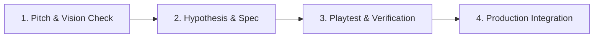

# Feature Design & Iteration Process

This document defines the standard lifecycle for proposing, designing, prototyping, and validating gameplay features in Pachi. Grounded in Richard Lemarchand's *A Playful Production Process* (3P) and the MDA Framework (Mechanics, Dynamics, Aesthetics), this process ensures every mechanic aligns with the core game vision ([`docs/vision.md`](file:///home/axel/workspace/axelmagn/pachi/pachi/docs/vision.md)) and delivers verifiable player satisfaction.

---

## 1. Feature Lifecycle Overview

Every gameplay addition moves through four sequential stages:



1. **Pitch & Vision Check**: Screen the concept against the four vision pillars in [`docs/vision.md`](file:///home/axel/workspace/axelmagn/pachi/pachi/docs/vision.md).
2. **Hypothesis of Fun & Spec**: Formulate a testable 3P hypothesis and map the mechanic to player dynamics and target aesthetics.
3. **Playtest & Verification**: Build a rapid prototype (sandbox scene or debug feature flag) and evaluate it against qualitative fun criteria.
4. **Production Integration**: Refactor into production code, document permanent rules in [`docs/design/gdd.md`](file:///home/axel/workspace/axelmagn/pachi/pachi/docs/design/gdd.md), and clean up prototype scaffolding.

---

## 2. The Four-Pillar Vision Scorecard

A feature must advance the core experience without diluting the game's identity. Proposals must evaluate against the four pillars:

| Pillar | Alignment Requirement | Screening Question |
| :--- | :--- | :--- |
| **1. It's Pachinko** | Advancing | Does this enhance tactile ball physics, launcher rhythm, pin deflections, or sensory payout excitement? |
| **2. It's Incremental** | Advancing | Does this deepen the layered progression curves or multi-tiered ball economies? |
| **3. It's a Deckbuilder** | Advancing | Does this offer strategic shop drafting, card synergies, or meaningful deck pruning? |
| **4. It's Simple** | **Non-Negotiable Guardrail** | Does this preserve the low-cognitive-load, relaxing "zone-out" aesthetic without creating annoying micromanagement? |

### Gate Rule
A proposal must actively advance **at least one** of Pillars 1, 2, or 3, and must **strictly pass** Pillar 4. Any feature that introduces tedious micro-actions (such as dragging cards onto individual pins repeatedly) fails Pillar 4 and is rejected or redesigned.

---

## 3. The Hypothesis of Fun

Every feature specification must articulate why the mechanic is fun using the 3P four-part formula:

$$\text{Hypothesis of Fun} = \text{Action} + \text{Aesthetic} + \text{Dynamic} + \text{Verification}$$

```markdown
If [Player Action or Mechanic],
they will experience [Target Aesthetic Emotion / Feeling],
because [Underlying Game Dynamic or Pacing Mechanism],
verified when [Observable Playtest Behavior or Qualitative Indicator].
```

### Example
> *If the player triggers a center yakumono jackpot,*  
> *they will experience an exhilarating sensory rush and visual feast,*  
> *because all tulip arms across the board snap open for 5 seconds to catch incoming ball streams and create cascading multiplier payouts,*  
> *verified when the playtester immediately accelerates launching balls and smiles or reacts audibly to the flashing lights and chimes.*

---

## 4. Tiered Prototyping Strategy

Prototypes isolate the design question to verify fun before investing in polished production code.

### Tier 1: Component Sandbox Prototypes
- **Scope**: Physical pin configurations, ball collision responses, tulip arm geometries, yakumono centerpiece animations, and procedural audio chimes.
- **Method**: Build directly in isolated test scenes (e.g. `res://src/art/visual_showcase.tscn` or a dedicated `res://src/sandbox/` scene).
- **Goal**: Tune kinetic feel, bounce angles, and visual clarity without running the whole game loop.

### Tier 2: System & Economy Prototypes
- **Scope**: Card drafting shops, deck synergy algorithms, ball tier pricing curves, and prestige reset loops.
- **Method**: Implement behind a runtime debug feature flag in the main game scene, accessible via a debug command palette or in-game cheat menu (e.g. toggleable instant balls, instant jackpots, force prestige).
- **Goal**: Test session pacing, strategy depth, and progression satisfaction in context.

---

## 5. Playtest Evaluation Protocol

Evaluate prototypes against three core qualitative criteria:

1. **Tactile & Sensory Satisfaction**: Does the interaction feel responsive, juicy, and physically satisfying to watch and hear?
2. **Mental Legibility**: Can a tired player understand the state changes and rewards at a glance without reading walls of text?
3. **Friction & Fatigue Check**: Does the action interrupt the relaxing flow of ball launching? If the player feels burdened by frequent chore-like interactions, redesign or automate the step.

---

## 6. Standard Feature Proposal Template

When drafting a new feature, author the specification at `.scratch/<feature-slug>/spec.md` using the following structure:

```markdown
# Feature: <Feature Name>

## 1. Vision Reconciliation Scorecard
- **Pachinko**: <How it advances physical pachinko excitement>
- **Incremental**: <How it contributes to layered progression>
- **Deckbuilder**: <How it deepens drafting or deck strategy>
- **Simplicity Check**: <Why it introduces zero micromanagement friction>

## 2. MDA Breakdown
- **Aesthetics**: <Target emotional responses: Sensation, Fantasy, Challenge, Discovery>
- **Dynamics**: <Emergent run-time player behaviors and game system responses>
- **Mechanics**: <Concrete rules, inputs, data structures, and state transitions>

## 3. Hypothesis of Fun
> If [Player Action], they will experience [Aesthetic Emotion] because [Dynamic Mechanism], verified when [Playtest Behavior].

## 4. Prototyping Plan
- **Prototype Tier**: <Sandbox Scene | Debug Feature Flag | Throwaway Branch>
- **Debug Hooks Needed**: <Cheat buttons, fast-forward, inspect tools>
- **Playtest Checklist**:
  - [ ] Tactile and audio feedback is satisfying.
  - [ ] State and consequences are immediately legible.
  - [ ] Zero chore friction detected during repeated play.

## 5. Graduation & Integration Criteria
<Specific conditions required to move this feature from prototype to production codebase and GDD.>
```
